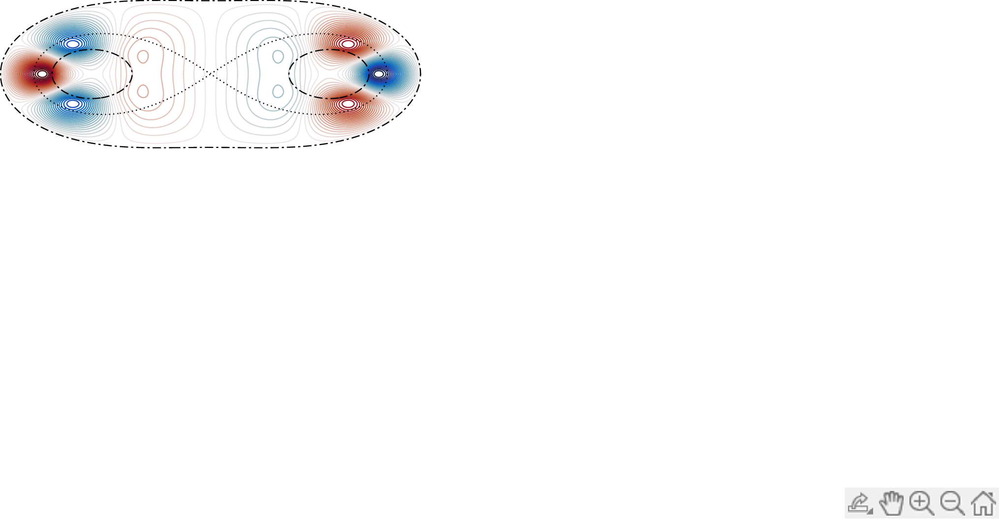
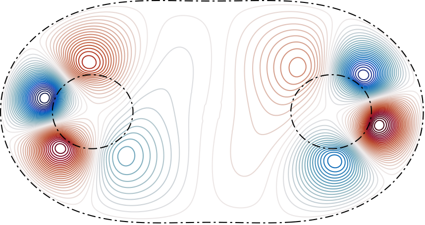
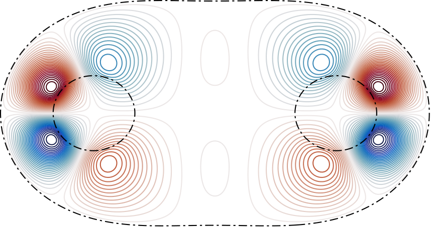
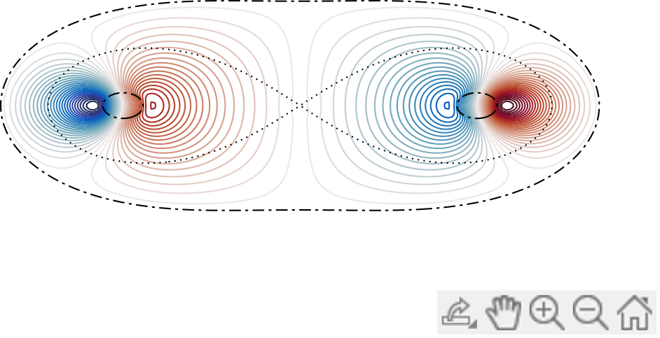
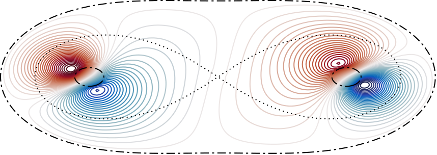
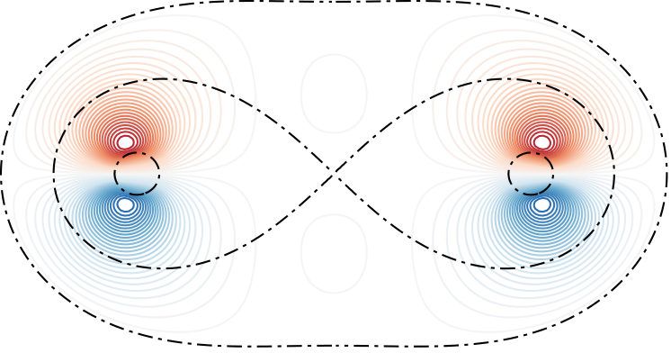
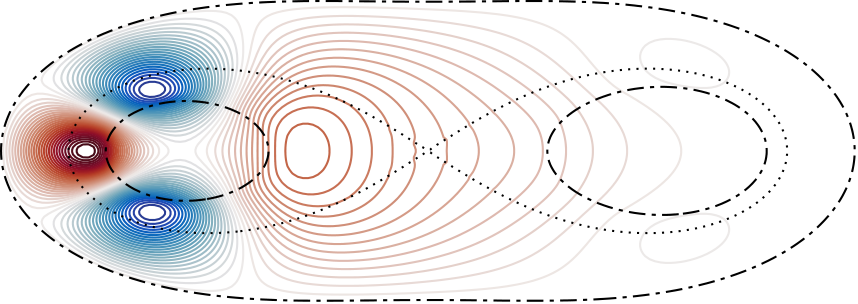
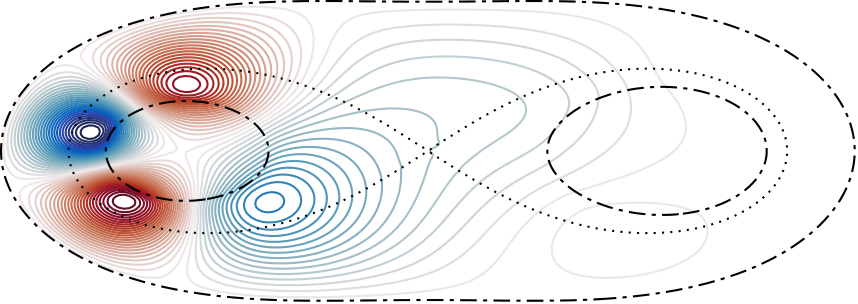
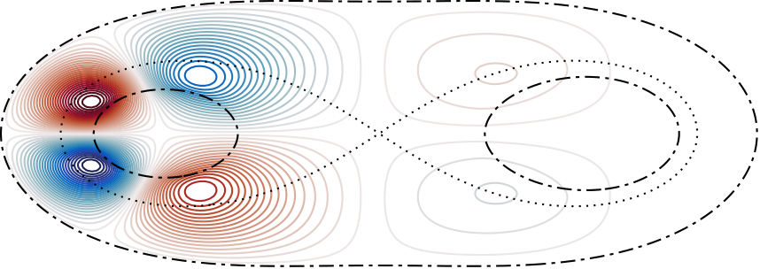

# Shallow-water-waves-in-a-two-and-N-basin-geometry
This code visualises (linear) Shallow-water waves in time going around a two-basin geometry reminiscent to a simple Arctic Ocean model using MATLAB. 

This code also permits waves travelling to N-basin geometries also. Below are some plots from a two-basin geometry moving in time t=0, T/3, 2T/3, where T is the period of the wave (the time taken for the wave to make one cycle to its original position around the basin). Here are some various modes travelling around different types of geometries.

Frequency and basin type| t=0 | t=T/3 | t=2T/3 |
| :-------------: | :-------------: | :-------------: |:-------------:|
|Two-basin, $\omega=0.2154$|  | ||
|Two-basin, $\omega=0.3689$, small basins $\sigma_{1}=\sigma_{2}=-1.5$|  | ||
|Two-basin, $\omega=0.2171$, asymmetric $\sigma_{1}=-0.25,\sigma_{2}=-0.5$|  | ||
|Three-basin (joined), $\omega=0.2159$|  | ||
|Three-basin (aligned), $\omega=0.2179$|  | ||
